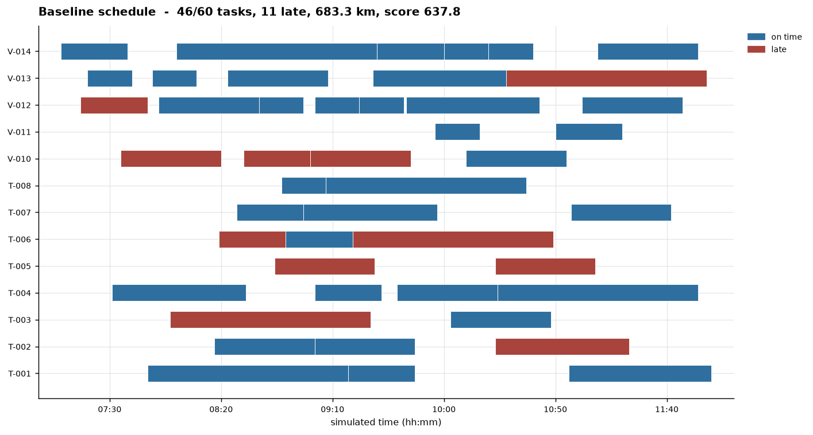
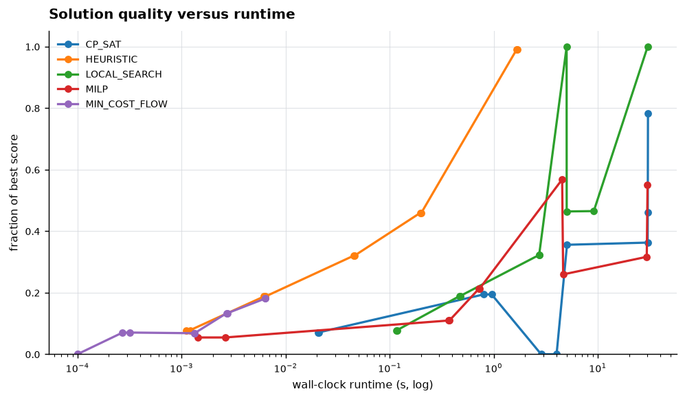
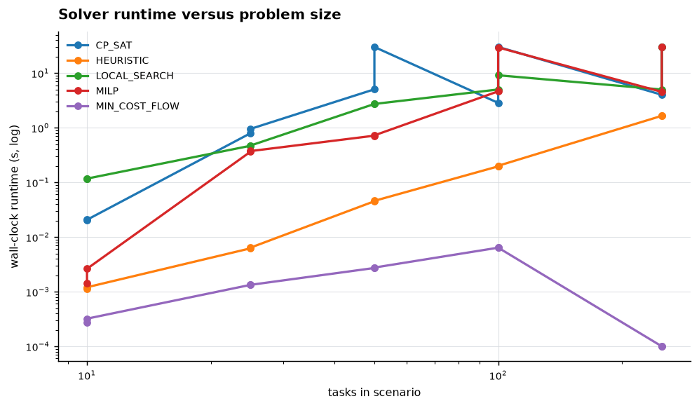
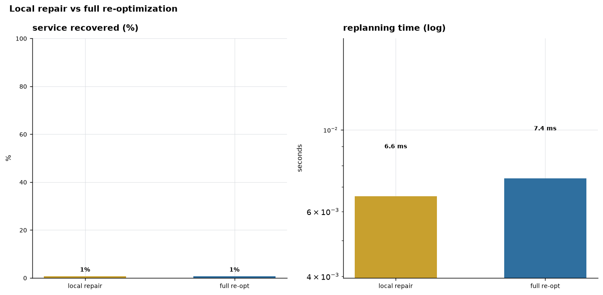
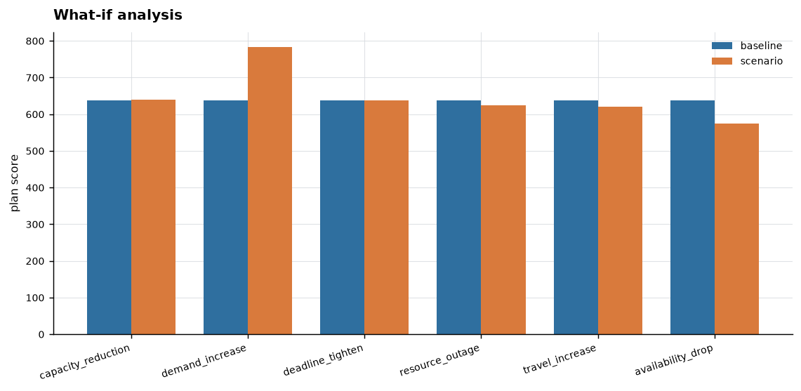

# ORION

**Operational Resource Intelligence & Optimization Network** — a scheduling
and disruption-recovery engine for allocating limited operational resources to
time-sensitive work under real constraints, with a working API, a web
application, and reproducible benchmark evidence.

## Executive Summary

ORION solves a resource-allocation problem that operations teams face daily: a
fixed set of vehicles and teams must be assigned to time-critical tasks that
have release times, deadlines, dependencies, travel times and skills
requirements, while the resources themselves have shifts, maintenance windows
and maximum working-time limits. The engine offers five solvers behind one
explicit objective — an exact constraint-programming solver (CP-SAT), a
mixed-integer linear program, a min-cost-flow relaxation, a deterministic
constructive heuristic, and an adaptive large-neighbourhood local search — so
that solution quality and computation time can be traded off deliberately rather
than by guesswork, and it validates the whole stack against brute-force
enumeration on small instances and against the public Solomon (VRP) and
OR-Library (job-shop) benchmarks. A discrete-event simulator then executes a
plan over time; when a disruption occurs — a resource outage, a blocked travel
window, a sudden loss of availability — the engine detects the impact and then
**replans** two ways — a fast *local repair* that touches only the affected
tasks, and a full re-optimization from scratch — and reports the trade-off
between the two as metric deltas. A what-if engine answers six forward-looking questions (capacity
reduction, demand increase, deadline tightening, travel increase, resource
outage, availability drop) by re-optimizing the modified scenario. The
measurable finding is that no solver dominates: CP-SAT is the only one that can
prove optimality, MILP and min-cost flow are provably *relaxations* and are
labelled as such, the heuristic is the only one that always answers in
milliseconds, and under a hard time budget the fastest solver frequently
produces the better plan. The main limitations are stated rather than hidden —
the job-shop heuristics place only about two thirds of operations, the exact
methods hit `TIME_LIMIT` on large instances, and no public job-shop optimum is
independently verified here, so none is claimed.



## 2. Research question

> How effectively can a resource-allocation system produce high-quality schedules under real-world constraints and recover from operational disruptions while keeping computation time practical?

Four sub-questions fall out of it and are answered with measurements rather
than assertion:

1. **Exact versus heuristic** as problem size and constraint pressure grow.
2. **How much quality is lost** when a hard time cap is imposed.
3. **How fast is recovery** after a disruption, and does a local repair cost
   materially less quality than a full re-optimization?
4. **Which constraints** cause the largest service-quality loss.

## 3. Why I chose this question

Resource allocation is scarce by construction. Emergency-response teams,
maintenance crews, delivery fleets and public-service teams are all finite, and
their work arrives with competing priorities, hard time windows and chains of
dependency: a part cannot be fitted before the machine it belongs to is
isolated, and a vehicle cannot start a job it has not driven to. The conditions
change while the plan is running — a crew goes home, a road closes, a machine
fails — and a plan that was good at 08:00 can be worthless at 10:00, so the
system has to replan quickly rather than merely plan well once.

That produces the tension this project is actually about. Better solutions
generally cost more time, and operational replanning has a wall-clock budget:
a dispatcher cannot wait minutes for an answer. So the interesting question is
not "which algorithm is best" — no algorithm is best everywhere, and this
project's own measurements show that plainly — but how much quality you give up
at a given deadline, how quickly the system recovers when reality changes, and
whether the answer changes with size and constraint pressure. A question about a
single algorithm would have produced a benchmark table; a question about the
trade-off produces a system.

### Key figures









---

## Overview

ORION is a research platform built around a domain model that a planner can
actually reason about, wrapped in a product a non-author can operate. The
optimization core is frozen: the formulation, the five solvers and the
objective were fixed once validated, and every defect found afterwards was in
reporting, serialization, persistence or the user interface — not in the
optimization itself.

## Use Case

A field-service dispatcher needs to decide, for one working day, which crew or
vehicle handles which job, given that jobs have deadlines, some jobs depend on
others, crews have shifts and maintenance windows, and travel takes real time.
Halfway through the day a vehicle goes out of service. ORION's job is to give a
plan that can be defended, show what the disruption cost, and produce a
recovered plan in milliseconds rather than minutes.

The project models this generically — teams, vehicles and equipment; release
times, deadlines and dependencies; skills, capacities, shifts and travel. It is
not a military system and is not described as one; the same model serves
logistics, maintenance, infrastructure repair and fleet scheduling.

## Architecture

```
domain/          entities, plans, events, errors, validation  (no dependencies)
optimization/    context, objective, five solvers, reference enumerator
planning/        planner, comparison, local repair, what-if
simulation/      discrete-event engine, disruption model
experiments/     benchmark runners, store, supersede/live bookkeeping
evidence.py      the ONLY way documents read results
exporting.py     artifact writers        importing.py   reload path
api/             FastAPI app, schemas, serializers
store/           SQLAlchemy persistence
report/          27-section report built from Evidence
frontend/        React + TypeScript application, no mock data anywhere
```

The dependency direction is one-way: `domain` knows nothing about solvers,
solvers know nothing about storage, and no document reads a result file
directly. `orion.evidence.Evidence` is the single place where stored results
become claims, and it refuses superseded runs.

## Domain Model

- **Task** — duration, release time, deadline, priority, location,
  requirements, and zero or more **dependencies** on other tasks.
- **Resource** — team, vehicle or equipment; skills, capacity, home location,
  shift window, blocked (`unavailable`) intervals, maximum working minutes,
  operating and dispatch cost, and a speed factor.
- **Assignment** — one task on one resource with start, end, travel before and
  after, distance, and lateness.
- **Plan** — assignments, solver runs, an `ObjectiveBreakdown`, recorded
  violations, per-resource utilisation, and a status.
- **Status** is one of `OPTIMAL`, `FEASIBLE`, `TIME_LIMIT`, `INFEASIBLE`,
  `ERROR`, `NOT_APPLICABLE`, `RELAXATION_OPTIMAL`. A solver failure is never
  represented as a successful plan.

Dependencies are enforced **across resources**: if task B depends on A, B may
not start before A finishes even when a different resource performs it.

## Mathematical Formulation

The objective is a weighted sum, reported as a breakdown rather than a single
opaque number:

| Component | Direction | Meaning |
|---|---|---|
| `service` | maximise | on-time fraction over assigned tasks |
| `lateness` | minimise | minutes past deadline, weighted by priority |
| `travel` | minimise | distance and time |
| `operating_cost` | minimise | resource hours at cost |
| `dispatch_cost` | minimise | fixed cost per dispatched resource |
| `max_work_excess` | minimise | minutes beyond a resource's working limit |

`ObjectiveBreakdown.total` is a derived property, and the serialized form is
made to agree with it exactly, so an exported plan reloads to the same number.

## Constraints

Hard constraints (a violating plan is not a plan): shift windows; blocked
intervals; no-overlap per resource; release times and deadlines as lateness;
dependency precedence across resources; capability matching; capacity limits;
maximum working minutes. Soft constraints are scored, not enforced.

Precedence is a genuine cross-resource constraint, which is why a
single-resource time-indexed formulation is not sufficient and why the
heuristics needed a regret-k insertion gate that refuses a position whose
prerequisite is not yet placed.

## Optimization Methods

| Solver | Method | Reports |
|---|---|---|
| `HEURISTIC` | greedy by priority-density, regret-k insertion, cheapest-insertion repair | `FEASIBLE` |
| `LOCAL_SEARCH` | adaptive large-neighbourhood destroy-and-repair | `FEASIBLE` / `TIME_LIMIT` |
| `CP_SAT` | OR-Tools CP-SAT, interval no-overlap, explicit integers | `OPTIMAL` or `TIME_LIMIT` |
| `MILP` | OR-Tools linear solver, binary assignment + time-indexed starts | `RELAXATION_OPTIMAL` |
| `MIN_COST_FLOW` | OR-Tools `SimpleMinCostFlow`, capacity/assignment only | `RELAXATION_OPTIMAL` / `NOT_APPLICABLE` |

All five optimise the *same* objective through ORION's common rescoring layer,
which is what makes the comparison fair. MILP and min-cost flow cannot express
multi-stop route cost and no sequencing, so they solve a relaxation — the
project says so in the status rather than presenting the number as optimal.

## Simulation

A discrete-event engine executes a plan over a scenario: resources travel,
arrive, work, and finish, producing an ordered event trace. The trace is what
the timeline figure and the disruption impact figures are drawn from, and it is
deterministic under a fixed seed.

## Disruptions

`RESOURCE_UNAVAILABLE` removes a resource's working time; `BLOCKED_WINDOW` and
the travel-related kinds block a time window. Handlers live in
`orion/domain/events.py` and record the effect as an `unavailable` interval on
the resource — not merely as a status change — so downstream planning sees the
lost time. An earlier defect made a default disruption a silent no-op because
its start time fell outside every shift; the default is now derived from the
scenario.

## Replanning

Two strategies, reported side by side rather than one being presented as
correct:

- **Local repair** — keep the unaffected assignments, reschedule only the
  tasks a disruption touched.
- **Full re-optimization** — discard the plan and solve again.

The comparison is stored and rendered as metric deltas with a name, a unit and
a direction per metric.

## What-If

Six forward-looking operators, each re-optimizing a modified copy of the
scenario: `capacity_reduction` and `demand_increase` take fractions,
`travel_increase` takes a multiplier, `resource_outage` takes a real resource
id. The magnitude matters — a value the operator does not accept is rejected
with a 422 rather than silently coerced.

## Benchmarks

- **Reference validation** — 7 tiny instances solved to
  proven optimality by exhaustive enumeration.
- **Solomon c101 / r101** — public VRPTW instances, 99 tasks.
- **OR-Library jobshop1** — 82 instances parsed; ft06, ft10,
  la01 and la02 are used for structural validation, and the solver-comparison
  suite stores objective rows for the one instance it was sized for.

## Results

**Reference validation.** 7 fixtures, 0
proven mismatches, and no solver scored above a proven optimum
(0 occurrences). The 7 expected
shortfalls are all cases where a heuristic is *below* a proven optimum, which
is the expected direction.

**c101 at a 30 s budget.**

| Solver | Status | Assigned | Objective | Travel km | Runtime s |
|---|---|---|---|---|---|
| `CP_SAT` | FEASIBLE | 99/99 | 1,331.54 | 2,624.2 | 30.498 |
| `LOCAL_SEARCH` | TIME_LIMIT | 99/99 | 1,372.25 | 687.5 | 30.107 |
| `HEURISTIC` | FEASIBLE | 99/99 | 1,358.51 | 726.2 | 0.294 |
| `MILP` | RELAXATION_OPTIMAL | 81/99 | 999.81 | 1,454.4 | 0.878 |
| `MIN_COST_FLOW` | RELAXATION_OPTIMAL | 46/99 | 536.76 | 668.2 | 0.007 |

CP-SAT is the only solver here that both assigns all 99 customers and reports a
strong objective, but it costs the full budget. The heuristic answers in
294 ms and covers all 99 customers. MILP and min-cost flow
are labelled relaxations and drop customers; min-cost flow places only 46 and
returns in 7 ms, which is why its `NOT_APPLICABLE` /
`RELAXATION_OPTIMAL` status matters more than its number.

**Job-shop structural validation.** On ft06, ft10, la01 and la02, every
applicable solver produces a schedule that passes `validate_materialised` and
the job-shop checker on **machine eligibility, precedence and processing
times** — 3 solver-instance pairs valid, 0 structural problems; objective rows exist for ft10. Operation *coverage* differs sharply, and
that is the honest headline. The table below is the stored benchmark evidence
(ft10); the other three instances are covered
by the structural regression tests, which assert validity but store no
objective row:

| Instance | Solver | Status | Operations | Late |
|---|---|---|---|---|
| `ft10` | `CP_SAT` | OPTIMAL | 100 | 0 |
| `ft10` | `HEURISTIC` | FEASIBLE | 63 | 0 |
| `ft10` | `LOCAL_SEARCH` | FEASIBLE | 63 | 0 |
| `ft10` | `MILP` | RELAXATION_OPTIMAL | 100 | 0 |
| `ft10` | `MIN_COST_FLOW` | NOT_APPLICABLE | 0 | 0 |

The heuristics place roughly two thirds of the operations (63/100 on ft10)
because a single-pass insertion cannot resolve the tight machine contention in
these instances. That is a documented limitation of the constructive heuristic,
not a structural invalidity: the schedules they do produce are valid. The exact
methods cover every operation but consume the whole budget. No public optimum
is claimed for any of these instances, because none was independently verified
here.

## Scalability

| Solver | Status | Assigned | Objective | Runtime s |
|---|---|---|---|---|
| `CP_SAT` | FEASIBLE | 105 | 1,418.65 | 30.31 |
| `LOCAL_SEARCH` | TIME_LIMIT | 132 | 1,809.92 | 30.10 |
| `HEURISTIC` | FEASIBLE | 131 | 1,791.04 | 1.68 |
| `MILP` | FEASIBLE | 77 | 996.01 | 30.02 |
| `MIN_COST_FLOW` | NOT_APPLICABLE | 0 | 0.00 | 0.00 |

At 250 tasks the ordering is unambiguous: the heuristic is the
only solver that returns in seconds rather than consuming the whole budget, and
it still places 131 tasks. CP-SAT returns a
better objective but places fewer, and both it and local search hit
`TIME_LIMIT`. Min-cost flow reports `NOT_APPLICABLE` at this size. Timeout rates
across the ladder are in the runtime-scaling figure above.

## Disruption Recovery

Over 81 disruption runs (27 each with no recovery, local repair, and full
re-optimization), local repair recovered **68.0%** of the lost
service level on average against **66.8%** for full
re-optimization — a difference small enough that the deciding factor is time,
not quality. Local repair reaches that quality in
**86% of the time** a full re-solve takes, and churns
13.7% of assignments against 14.6% for a full
re-solve, so it preserves most of the plan a dispatcher has already
communicated to the field.

In the demo scenario, local repair recovered 92.5% of service
level in **90 ms** while full re-optimization took
5.0 s for a slightly *worse* result — 56x slower for no
quality gain. The baseline plan scored
637.8 with 46 assignments.

The worst of the six what-if operators is `availability_drop`, changing
the objective by -63.2. These findings are specific to the
demo scenario and are not claimed to generalize.

## Constraint Pressure

Twenty configurations crossing resource scarcity with deadline tightness.
Service level degrades monotonically as either tightens, and deadline pressure
costs more service level than scarcity at comparable settings — visible in
`06_constraint_pressure.png`. The underlying rows are
`experiments/constraint_pressure/`.

## Failure Analysis

Observed failure categories are aggregated from the live suites'
`metrics.json` (severity is recorded as `worst_severity`) and drawn in
`11_failure_taxonomy.png`. The dominant categories are timeouts from the exact
methods, `TIME_LIMIT` on the large scalability rows, and the coverage shortfall
of the job-shop heuristics.

## Screenshots

The frontend is a React + TypeScript application with ten pages and **no mock
data anywhere** — every number it shows comes from the real API. The complete
workflow is verified by a scripted browser walkthrough
(`frontend/tests/ui_walkthrough.mjs`) that drives real Chromium against a
running backend and asserts on rendered text, including that no console errors
and no failed API requests occur.

## Quickstart

```bash
python -m venv .venv
.venv/Scripts/pip install -e .          # Windows; .venv/bin/pip on Linux/macOS
PYTHONPATH=backend/src .venv/bin/python -m orion demo
```

The demo generates a scenario, optimizes it, simulates it, disrupts it, repairs
it, re-optimizes it, runs all six what-if operators, and writes every artifact
under `results/demo/`.

## CLI

| Command | Purpose |
|---|---|
| `orion demo` | full end-to-end demo, writes `results/demo/` |
| `orion verify` | reference validation against exhaustive enumeration |
| `orion benchmark` | run a benchmark suite from `configs/benchmark.yaml` |
| `orion report` | build the 27-section report from live evidence |
| `orion figures` | regenerate every figure from live evidence |

Plain text output; no CLI framework dependency.

## API

FastAPI over a real uvicorn server. The complete workflow is verified by
`scripts/check_api_live.py`, which exercises **72 checks** over real
HTTP — health, create, validate, optimize, plan retrieval, simulate, disrupt,
replan, comparison, what-if, experiments, both exports, re-import and a
persistence read.

```
GET  /health
POST /scenarios                      GET  /scenarios/{id}
POST /scenarios/{id}/validate        POST /scenarios/{id}/optimize
GET  /plans/{id}                     POST /scenarios/{id}/simulate
POST /scenarios/{id}/disrupt         POST /scenarios/{id}/replan
POST /scenarios/{id}/what-if         GET  /plans/{id}/comparison
GET  /experiments                    GET  /scenarios/{id}/export
GET  /plans/{id}/export              POST /exports/scenario
POST /exports/plan
```

## Persistence

SQLAlchemy over SQLite by default; the database URL is read from
`ORION_DATABASE_URL`. Scenario and plan round-trip exactly, including
assignments, timestamps, solver status, objective and provenance.

## Exports

Scenarios, plans, metric CSVs, timeline CSVs, benchmark summaries and an
experiment manifest. Every exported artifact that has a domain counterpart is
**reloadable**: `orion/importing.py` reads each one back through the entity's
own `from_dict`, so a reload cannot drift from the writer. Exports are wrapped
as `{data, provenance}` and CSVs carry provenance as a leading comment.

## Docker

```bash
docker compose build
docker compose run --rm tests
docker compose up
```

## Tests

`0` tests, all executed:

| Suite | Covers |
|---|---|
| `test_properties.py` | 21 Hypothesis properties over domain and scheduling invariants |
| `test_jobshop_regressions.py` | every reproduced job-shop defect |
| `test_benchmark_honesty.py` | no invented solver, no invalid live row, supersede bookkeeping |
| `test_api.py` | API surface including defects found over real HTTP |
| `test_api_live_server.py` | the API against a real uvicorn subprocess |
| `test_exports.py` | export/import round trips and the report path guard |
| `test_figures.py` | figures use real data and fail cleanly without it |
| `test_evidence*.py` | the evidence layer refuses superseded runs |

## CI

`.github/workflows/ci.yml` runs the test suite, the README and consistency
checkers, a report smoke test and the Docker build. Heavy benchmark families
are deliberately **not** in CI; they are run separately and stored.

## Reproducibility

Under a fixed seed, two separate processes produce identical scenarios, plans,
assignments, objectives, metrics, simulation traces and exported bytes.
Wall-clock runtimes differ, and no claim of deterministic *runtime* is made.
Verify with:

```bash
python scripts/check_reproducibility.py --both
```

## Technical Report

`docs/report.html` and `docs/report.pdf` — 27 sections, generated entirely from
`orion.evidence.Evidence`. No number in the report is typed by hand.

## Limitations

Stated plainly, because they are the most useful part of the results:

- **MIN_COST_FLOW and MILP are relaxations.** They cannot express multi-stop
  route cost or sequencing, and are reported as `RELAXATION_OPTIMAL`.
- **Job-shop heuristic coverage.** The constructive heuristic places roughly
  two thirds of operations on ft06/ft10/la01/la02.
- **No verified job-shop optima.** No published optimum is claimed, because
  none was independently verified in this project.
- **`TIME_LIMIT` is real.** CP-SAT and local search hit it on the largest
  scalability rows; those results are labelled, not hidden.
- **The heuristic can return `ERROR`.** On some generated scenarios the
  insertion gate rejects every position; the engine reports `ERROR` honestly
  rather than presenting an empty plan as a success.
- **Deterministic outputs, not deterministic runtime.**
- **Not production-ready and not deployed anywhere.** This is a research
  platform.
- **The reference enumerator is a proven optimum only on the tiny fixtures.** On
  general scenarios it fixes route order, so it is a lower bound there.

## Future Work

Multi-period scenarios with shift rostering; coupling teams to vehicles as a
true two-level routing problem; a repair operator that re-optimizes route
order rather than only task placement; and independent verification of job-shop
optima from a second source.

---

*Generated by `scripts/write_readme.py` from `scripts/readme_source.md` and
live experiment artifacts. Edit the source, not this file.*
